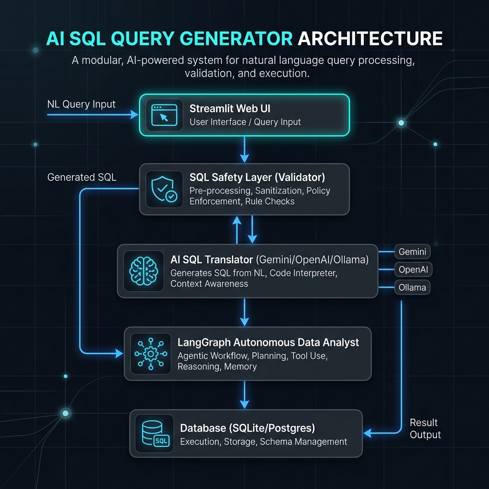

# SmartSQL AI Query Assistant & Analyst 🧠📊

SmartSQL is an enterprise-grade, open-source AI SQL Query Generator and Autonomous Data Analyst web application. Built using Python, Streamlit, and LangGraph, it translates natural language business questions into optimized, safe SQL queries, explains them in non-technical terms, executes them against databases, and suggests interactive Plotly visualizations.

---

## 🏗️ System Architecture

The application is structured as a modular, sandboxed pipeline to ensure security and scalability:



---

## 🌟 Key Features

1.  **Multi-Database Connectivity:**
    *   **SQLite:** Direct file uploads.
    *   **CSV Uploads:** Upload multiple CSV files which are automatically parsed and mapped into an in-memory SQLite database.
    *   **PostgreSQL:** Secure credentials connections with SQLAlchemy pooling.
2.  **SQL Safety Layer (Sanitization & Policy Enforcement):**
    *   Enforces a strict **read-only** execution policy (blocks `DROP`, `DELETE`, `UPDATE`, `INSERT`, `ALTER`, `TRUNCATE`, etc.).
    *   Blocks multi-statement injections (via strict semicolon check).
    *   Strips comments (`--` and `/* ... */`) before scanning to prevent bypass attempts.
    *   Blocks unauthorized system catalog access.
3.  **Multi-LLM Provider Wrappers:**
    *   Integrated with **Google Gemini (Default: `gemini-2.5-flash`)**, **OpenAI**, and local **Ollama** servers.
4.  **Autonomous AI Analyst Mode:**
    *   Uses **LangGraph** to build multi-step analysis plans. 
    *   Autonomously runs multiple sub-queries, executes them safely, and synthesizes findings into a markdown Executive Report.
5.  **Automated Plotly Express Canvas:**
    *   Detects column data types and card cardinality to recommend charts (e.g. Line for time series, Pie for shares, Bar for counts, Scatter for numerical pairs).
6.  **Persistent History & Favorites Logging:**
    *   Records query metrics (execution times, row count) and saves favorite queries.

---

## 📂 Project Structure

```text
project/
├── app.py                     # Main Streamlit UI entrypoint
├── requirements.txt           # Python packages list
├── Dockerfile                 # Web app containerization
├── docker-compose.yml         # Container orchestrator (Web App + PostgreSQL)
├── README.md                  # This README guide
├── .env.example               # Template environment parameters
├── src/
│   ├── llm/
│   │   └── provider.py        # OpenAI / Ollama / Gemini clients
│   ├── database/
│   │   ├── connection.py      # SQLAlchemy connection pooling
│   │   ├── schema.py          # Dynamic metadata extraction
│   │   └── history.py         # Persistent SQLite logs
│   ├── sql_engine/
│   │   ├── translator.py      # NL-to-SQL logic
│   │   ├── explainer.py       # SQL business explanations
│   │   └── executor.py        # Safe query executor
│   ├── visualization/
│   │   └── recommender.py     # Automated Plotly graphs
│   ├── security/
│   │   └── safety_layer.py    # Sanitizers and keyword blockings
│   ├── analytics/
│   │   └── agent.py           # LangGraph autonomous workflow
│   └── utils/
│       └── logging_config.py  # Telemetry configuration
└── tests/                     # Unit test suites
```

---

## ⚙️ Installation & Setup

### 1. Clone & Set Up Directory
```bash
git clone <your-repository-url>
cd ai_sql_generator
```

### 2. Configure Environment Variables
Copy the `.env.example` file to `.env` and fill in your API key details:
```bash
cp .env.example .env
```
Open `.env` and add your Google Gemini, OpenAI, or Ollama credentials:
```text
GEMINI_API_KEY=AIzaSy...
LLM_PROVIDER=gemini
LLM_MODEL=gemini-2.5-flash
```

### 3. Run Locally (Standard Python setup)
Install dependencies and launch the app:
```bash
pip install -r requirements.txt
streamlit run app.py
```

### 4. Run via Docker Compose
To spin up the web application along with a local PostgreSQL server instance:
```bash
docker-compose up --build
```
Once initialized, access the dashboard at **[http://localhost:8501](http://localhost:8501)**.

---

## 🧪 Running Tests

The test suite validates connection poolings, safety filters, translators, and LangGraph workflow nodes.
```bash
python3 -m unittest discover -s tests -p "test_*.py"
```
